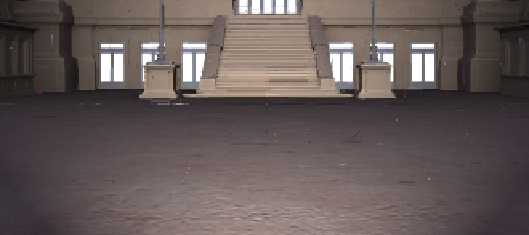
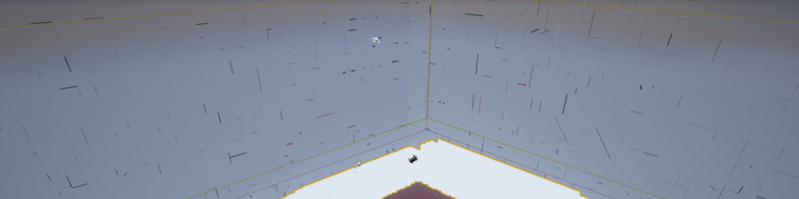

# Importing Seurat Meshes Into Unity

Seurat is a scene simplification technology designed to process very complex 3D scenes into a representation that renders efficiently on mobile 6DoF VR systems.

This document covers how to import Seurat meshes into Unity. To learn more about the Seurat pipeline, visit the main [Seurat GitHub page](https://github.com/googlevr/seurat).

## Introduction

This document is organized into two sections. The first describes the steps to
load a mesh produced by Seurat into Unity. The second provides detailed
diagnostic steps to examine if the imported Seurat mesh shows artifacts, gaps,
or cracks in various places, typically along the edges of the mesh.

The document assumes some familiarity with the Unity Editor, and is written
against version 5.6.*.

## Importing Seurat Meshes

The instructions in this section assume the following file layout:
`c:\Unity_Projects\SeuratImport` contains a blank Unity project.
`c:\Seurat_Output` contains a set of files produced by Seurat: in particular
`seurat.obj`, `seurat.png`.  Follow these steps to import the Seurat output into
Unity:

1. Import Prerequisites
   * Open the SeuratImport project in Unity.
   * Import the Seurat Unity capture package into the project with
     _Assets | Import Package | Custom Package_.
2. Import the Seurat mesh and texture as an Asset
   * Use _Asset | Import New Asset_ to copy seurat.obj and seurat.png into the
     Unity project’s Assets folder.
   * Browse the Assets folder in Project window.
   * Locate the Seurat output model `seurat.obj` in the Assets folder.
3. Add the Seurat mesh to the Scene.
   * Drag and drop the `seurat.obj` model from the Asset folder into the Scene
     window (or Hierarchy window, as appropriate).

     Note: Unity may split the mesh into several parts to fit under vertex count
     limits.
   * Unity should then display a solid-shaded version of the Seurat mesh.
4. Apply the Seurat shader to the Seurat mesh.
   * Locate the new node, _seurat_ instancing the seurat.obj in the Hierarchy
     window, and expand the hierarchy it contains until the leaf nodes are
     visible. The hierarchy should contain something like the following nodes,
     and the leaf nodes will have _Mesh Render_ components attached:
     * seurat
       * default
         * default_MeshPart0
         * default_MeshPart1
         * default_MeshPart2
    * Select the first leaf node a _Mesh Render_ component, _default_MeshPart0_.
    * Locate the _Mesh Render_ component in the Inspector panel.
    * Apply the Seurat shader to the geometry; click the Shaders popup at the
      bottom of the panel, and navigate the menu to the shader GoogleVR |
      Softserve | AlphaBlended, and click that menu option to apply the alpha
      blended material.
5. Apply the Seurat texture atlas to the mesh
   * Locate the Seurat output texture atlas seurat.png in the Assets folder.
   * Apply the texture atlas to the chunks of the Seurat mesh: drag and drop
     seurat.png onto each of the leaf nodes, here named _default_MeshPart*_.
6. Configure Texture Atlas Settings
   * Select the seurat.png texture in the Assets browser.
   * Locate the Inspector panel for the texture.
   * Expand the _Advanced_ rollup.
   * Disable the option _Generate Mip Maps_.
   * Change _Wrap Mode_ to _Clamp_.
   * Locate the build platform subpanel.
   * Enable _Override for PC, Mac, & Linux Standalone_.
   * Change _Max Size_ to a resolution greater-than or equal-to the dimensions
     of the seurat.png. Typically this will be 4096, but depends on Seurat
     processing settings. Note: Seurat requires that Unity not resize the
     texture!
   * Click the _Apply_ button at the bottom of the panel.
   * Unity will reprocess the texture, and should now display the Seurat mesh
     correctly.

If the Seurat output has artifacts, or does not look correct, please continue on
to the next section. The section provides detailed instructions on configuring
both the imported assets, Unity project settings to correctly render Seurat
meshes.

## Diagnosing Cracks
This section illustrates what crack artifacts may appear, and lists many Unity
settings that can trigger these artifacts.



### Determine the cause
The easiest way to determine the cause of crack or gap artifacts in Seurat
output is to set the camera background color to something with great contrast to
the scene (e.g. bright red) and see if there are holes in the mesh generated by
Seurat.

* If you see holes in the mesh, you should try to rebake with higher quality
  settings.
* If you do not see holes, adjust texture and shader settings.

### Texture Settings
* Bilinear Filtering
* For premultiplied alpha, uncheck _Alpha is Transparency_. Otherwise, Unity
  will inpaint the transparent areas of the texture (this process can be
  lengthy) and will show artifacts in areas that are supposed to be completely
  transparent.
* NO mip maps
* Low or No anisotropic filtering ~ 1-2 in Unity, any higher may cause cracks
* Do not autoresize to power of 2
* Wrap mode: clamp
* A Unity project setting can affect the texture resolution during the Unity
  application build. Check that the _Texture Quality_ option under _Edit |
  Project Settings | Quality_ is set to _Full Res_.

### Mesh Settings
* Make sure mesh compression is turned off for the UV0 channel in _Project
  Settings | Player | Android | Vertex Compression_

### Shader Settings

#### Centroid and Anti Aliasing
If you are using MSAA, you may notice edge artifacts.  Centroid interpolation
will fix edge sampling errors caused by MSAA.  For more information, see Fabien
Giesen’s post.  In Unity, this can be done by appending `_centroid` to the
`TEXCOORD#` interpolator semantic like so:

```glsl
struct VertexToFragment {
  float4 position : SV_POSITION;
  float2 uv : TEXCOORD0_centroid;
}
```

Fragment shader texture coordinate precision is important. Use `highp` or
`float` precision for texture coordinate variables rather than `lowp` modifier
or the HLSL `min16` prefix.

IMPORTANT: Centroid requires Open GL ES 3.0, and is performance intensive.  Only
use centroid interpolation if you are using MSAA, and absolutely need it.
Currently the _centroid modifier is implicated in GPU driver issues on Pixel
devices. Workarounds / bug fixes are in progress.

Unless you absolutely need depth write (e.g. you are doing something fancy, like
casting dynamic shadows off Seurat geometry) - you should prefer Alpha Blending.

#### Alpha Blended
* UV0 set to _centroid interpolation OR disable MSAA
* Cull Off
* ZWrite Off
* ZTest LEqual
* Queue: Transparent
* Blend SrcAlpha OneMinusSrcAlpha

#### Alpha Tested
* UV0 set to _centroid interpolation OR disable MSAA
* Cull Off
* ZWrite On
* ZTest LEqual
* Queue: Transparent
* Blend SrcAlpha OneMinusSrcAlpha
* Alpha-to-coverage
* Unity: AlphaToMask On

### Skybox, Clear Color and Background
Some Seurat scenes can have gaps (cracks, you could say) of varying size against
the background. You should let the team know if you encounter these. Still,
colors from background color can bleed through and appear as cracks.

Several things in Unity can generate a background color:

1. Geometry in the scene drawn before Seurat’s mesh. Try toggling it on and off
   to see if a skybox mesh is generating cracks, for example.
2. The _Skybox Material_ option of the Scene tab of Lighting inspector panel
   (_Window | Lighting | Settings_), can control the background color. To
   evaluate if this feature is contributing to the problem, try selecting a
   black material or a bright red material to see if this changes any of the
   cracks.
3. In the Camera inspector panel of the node containing the LDI Headbox for the
   capture, _Clear Flags_ and _Background Color_ control buffer color
   initialization for the capture.

### Capture Settings
If none of the above fixes the issue, or you see holes in the mesh - try
rebaking with higher quality capture settings.

DISCLAIMER: This is not an officially supported Google product.

